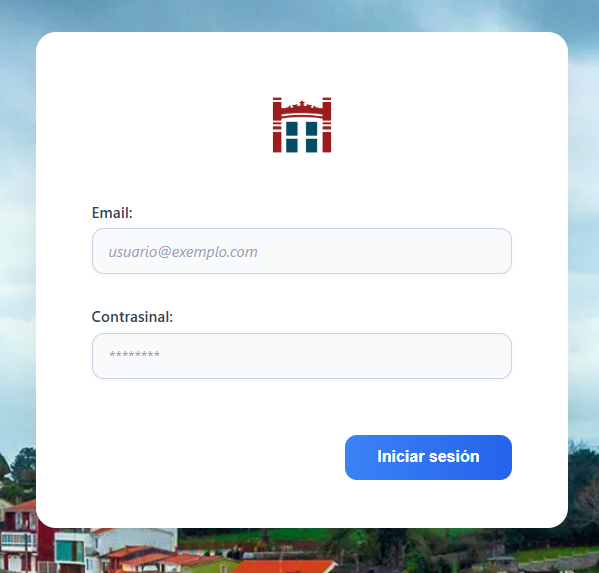
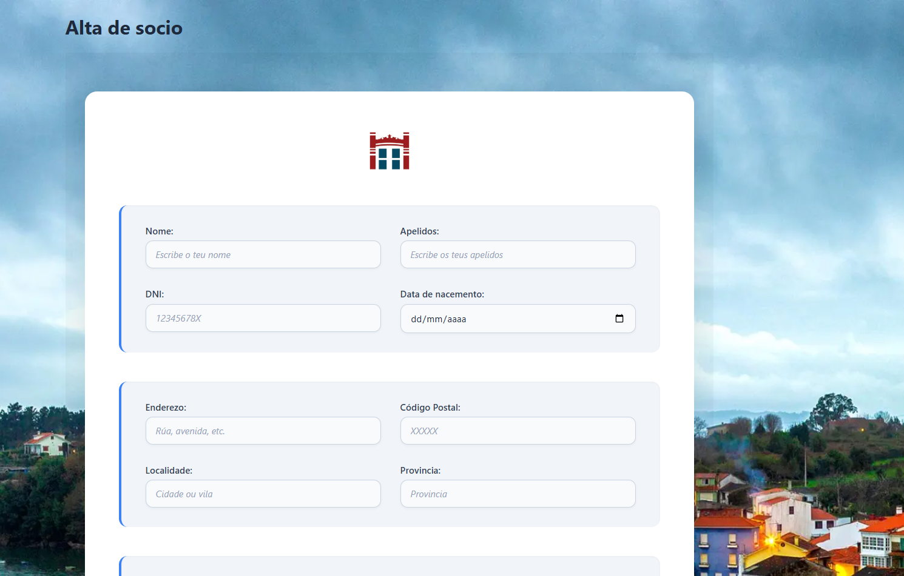
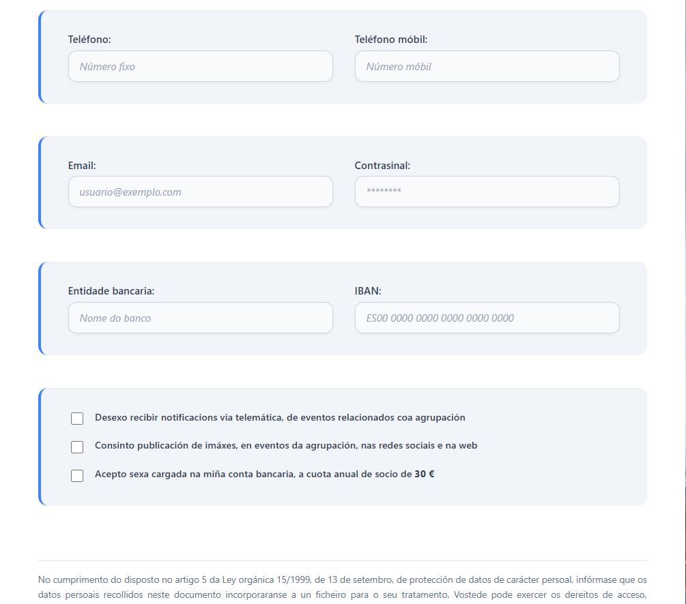
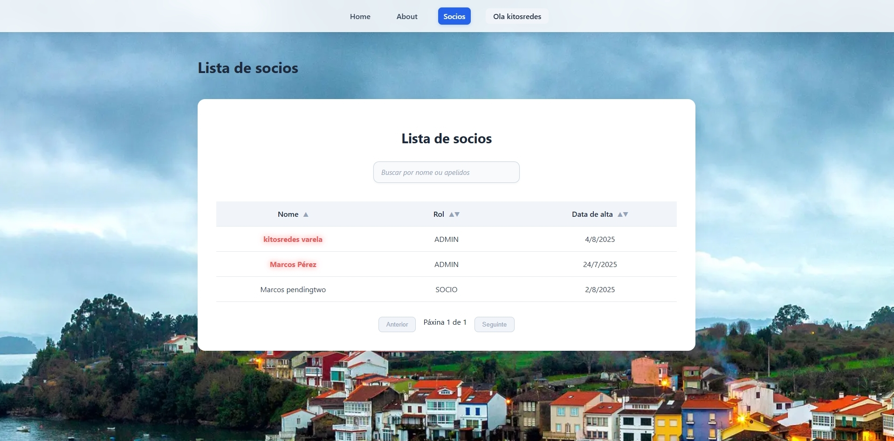

# AICMembers 🧑‍💼

**AICMembers** is a web application designed to help my town association manage its members and contribute to its digitalization. It allows users to register, authenticate using JWT, and be approved or rejected by administrators. The system emphasizes security, structure, and scalability.

This is my first full-stack solo project, where I'm using several new technologies — including **Vue**, which I had never worked with before — as well as the **hexagonal architecture**. Any feedback regarding the code quality, architecture, or structure is very welcome!

## 🔧 Tech Stack

### Backend
- Java 17
- Spring Boot 3
- Spring Security (JWT)
- PostgreSQL
- Maven
- Hibernate / JPA

### Frontend (in progress)
- Vue 3
- TypeScript
- Vue Router
- Vite
- Pinia
- Axios

## ⚙️ Main Features

- Secure user registration with validation and password encryption.
- JWT-based authentication and stateless session management.
- Global JWT filter for protecting secured endpoints.
- User states: `PENDING`, `ACTIVE`, `INACTIVE`.
- Role-based access control: `ADMIN`, `MODERATOR`, `SOCIO`, `ASPIRANTE`
- Admin functionality to approve or reject new members.
- Consulting member list and apply filters

## 📦 Project Structure: Hexagonal (Ports and adapters)

backend/  
├── application/ # Business logic (DTOs, services, mappers)  
├── domain/ # Domain model and repositories  
├── infrastructure/ # Security, config, utilities  
├── web/ # REST controllers  

## 🔐 Security

- JWT authentication and authorization.
- Passwords hashed using BCrypt.
- Custom JWT filter for every request.
- Role-based route protection.

## 🗃️ Database

PostgreSQL. A local instance is recommended (default port: `5433`). Credentials can be configured in `application.properties`.

## 🚀 Getting Started
### Database: Set up your PostgreSQL database  
### Backend: Execute it using mvn spring-boot:run or from your preferred IDE 
### Frontend: npm run dev

## 📄 License  
MIT License

## Screenshots
All functionalities shown here are fully functional. Galician (GL) is the main language.

### Pantalla de inicio de sesión

### Formulario de alta de socios

### Lista de socios

